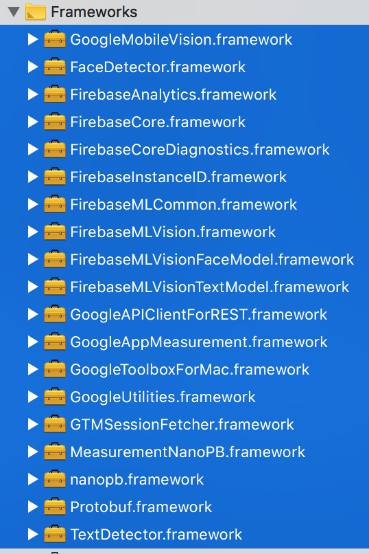
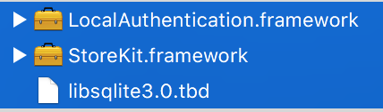
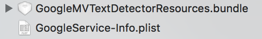
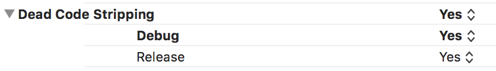

# react-native-shuga-ocr

## Getting started

`$ npm install react-native-shuga-ocr --save`

### Mostly automatic installation

`$ react-native link react-native-shuga-ocr`

### Additional installation steps

#### iOS

- Download and unzip [Firebase SDK for iOS](https://firebase.google.com/download/ios)

- Find the following frameworks (19 of them) in Firebase SDK and drag them to your project's Framework:

	NOTE: `MeasurementNanoPB.framework` is not required for Firebase SDK > 5.9.0

	

- Go to your project's main TARGET -> Build Phases -> Link Binary With Libraries, and add the following items (3 of them):

	

- Also from the Firebase SDK, find `GoogleMVTextDetectorResources.bundle` and drag it to your project's and add it to your TARGET, note that this is not a Framework!

- Add your project specific Firebase `GoogleService-Info.plist` to your TARGET

	

- You may encounter [this issue](https://github.com/firebase/quickstart-ios/issues/487) on Firebase 5.9.0, this can be fixed by setting YES to your TARGET's Dead Code Stripping

	

#### Android

- Add Firebase's ```google-services.json``` to your Android project

- Add the following line into your project build.gradle
	
	```compile 'com.google.firebase:firebase-core:16.0.3'```

	or this line if you're using newer version of gradle:

	```implementation 'com.google.firebase:firebase-core:16.0.3'```


## Usage
```javascript
import ShugaOCR from 'react-native-shuga-ocr';

...

const result = await ShugaOCR.scanTextInImage(dataInBase64);
console.log(result);
```
